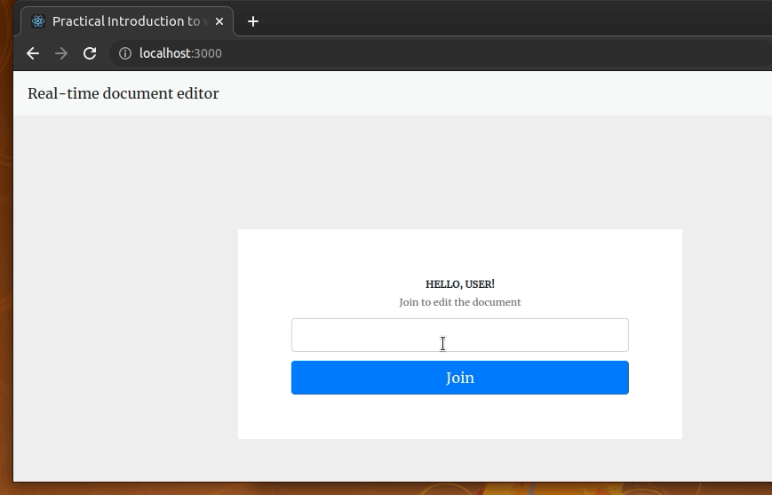

# websocket_react
# react-node-websockets-demo
A simple collaborative document editing app built with React and Node



## How to run the app?

```bash
#-- Setup and start the server
cd server
npm install # or yarn install
npm start # or yarn start

#-- Setup and start the client
cd client
npm install # or yarn install
npm start # or yarn start
```
